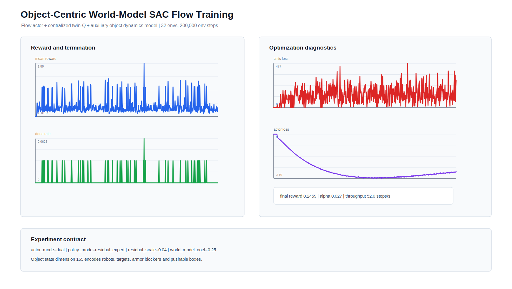
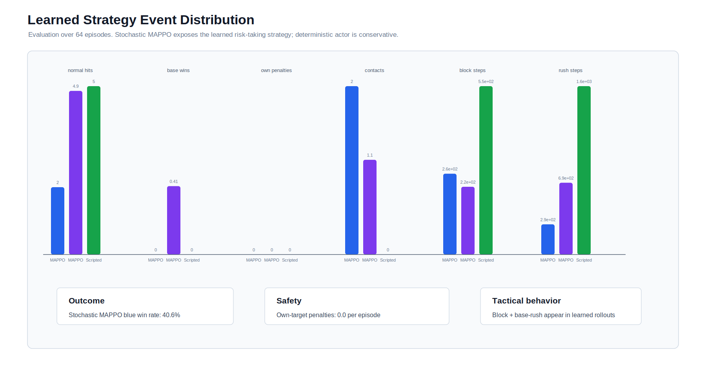
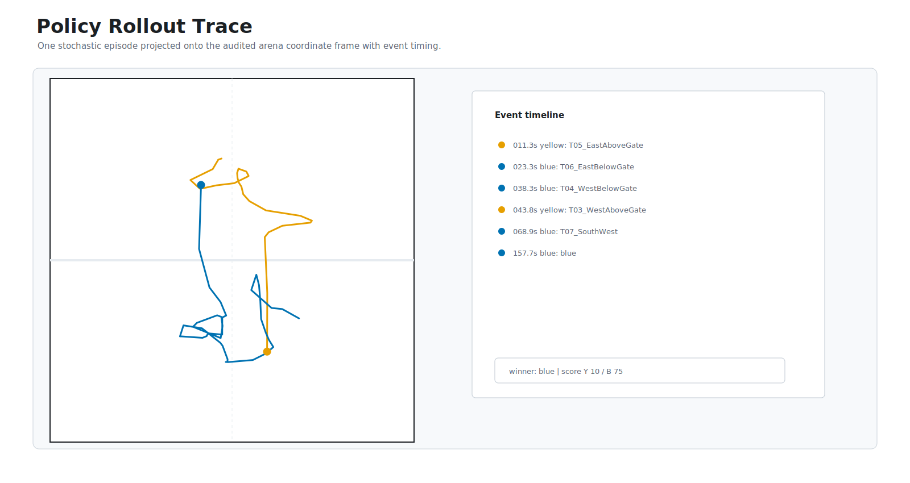
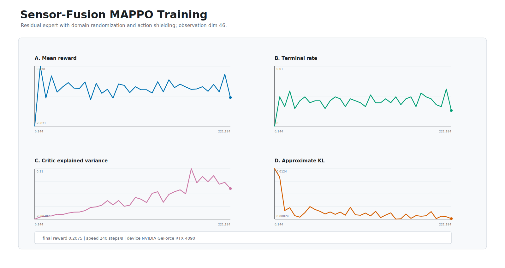
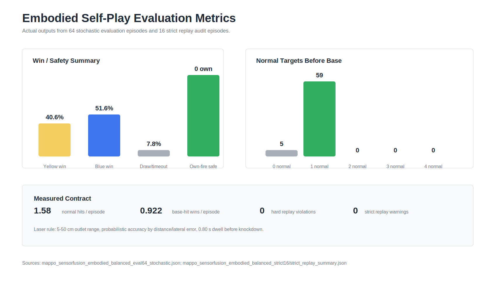

# Multi-Agent Robot RL: IsaacLab + ROS2 Sim2Real

[](https://docs.ros.org/en/jazzy/)
[](https://ubuntu.com/)
[](https://isaac-sim.github.io/IsaacLab/)
[](isaaclab_sim/rl/)
[](LICENSE)

Multi-Agent Robot RL is a practical robotics stack for multi-agent reinforcement learning, IsaacLab simulation, ROS2/Nav2 deployment, sensor fusion, visual target interaction and Sim2Real evaluation. It uses a RoboCup-style visual challenge arena as a hard benchmark, but the reusable pieces are broader: dual-agent MAPPO self-play, rule-aware action shielding, pushable rigid obstacles, ROS2 runtime contracts and reproducible evaluation/replay tooling.

Search keywords: multi-agent reinforcement learning, robot learning, IsaacLab, Isaac Sim, ROS2, Nav2, Sim2Real, MAPPO, autonomous robots, sensor fusion, visual navigation.

This repository documents the engineering solution evolved from a national top-three RoboCup China visual challenge entry, rewritten as a clean, reproducible, self-contained portfolio system. The submitted ROS2 engineering workspace is `crc_robocup_vision_ws/`.


The project has been reorganized from a ROS1 research prototype into a ROS2 Jazzy portfolio project with separated navigation, vision, shooter control, behavior orchestration, robot description and documentation packages.

## Highlights

- ROS2 Jazzy workspace using `colcon` and `ament_cmake`
- Nav2-based navigation with centralized costmap and controller parameters
- `slam_toolbox` mapping/localization configuration
- AprilTag Tag36h11 visual target detection from `/camera/image_raw`
- ROS2 service based shooter controller
- Competition state machine covering navigation, target search, alignment, opponent-only firing, retry and timeout handling
- IsaacLab two-robot arena scene with falling targets, armor removal, differential-drive motion and collision handling
- Realistic sensor stack: wheel odometry, IMU, 2D lidar, RGB/depth camera frames, ToF/bumper contacts and fixed laser module
- Rule-accurate laser model: 5-50 cm normal-target range, 20-80 cm recessed-base range, line-of-sight blockers, 0.80 s dwell gate and distance-dependent accuracy
- Recessed base targets behind ground-touching blue armor blockers, with 45-degree normal target placement
- Pushable rigid obstacle boxes whose map poses change in strict replay and IsaacLab playback
- Sim2Real domain randomization and a geometry-aware action shield for safer learned strategy execution
- Collision/stuck recovery through localization-confidence modeling and spin-in-place map rebuild
- Documentation for architecture, migration, Sim2Real, test results and third-party attribution

## Quick Start

```bash
cd crc_robocup_vision_ws
rosdep install --from-paths src --ignore-src -r -y
colcon build --symlink-install
source install/setup.bash
ros2 launch rcvrl_bringup competition.launch.py
```

Yellow-side elimination launch:

```bash
ros2 launch rcvrl_bringup competition.launch.py team_color:=yellow target_file:=$(ros2 pkg prefix rcvrl_navigation)/share/rcvrl_navigation/config/targets.elimination.yellow.yaml
```

Blue-side elimination launch:

```bash
ros2 launch rcvrl_bringup competition.launch.py team_color:=blue target_file:=$(ros2 pkg prefix rcvrl_navigation)/share/rcvrl_navigation/config/targets.elimination.blue.yaml
```

No-hardware launch smoke test:

```bash
ros2 launch rcvrl_bringup competition.launch.py start_navigation:=false shooter_dry_run:=true auto_start:=false
```

When building from WSL, copy the workspace into a native Linux path such as `~/crc_robocup_vision_ws` first. ROSIDL can fail when the workspace is built directly under a Windows-mounted path containing non-ASCII characters.

Python rule-environment smoke tests:

```bash
python -m pip install -r isaaclab_sim/rl/requirements.txt
python -m pytest tests -q
cd isaaclab_sim/rl
python evaluate_selfplay.py --episodes 8
```

IsaacLab preview on Windows should be launched through the project wrapper so
Kit writes user config, logs, pip envs and extension cache under
`.isaaclab_runtime/` instead of sharing the global Isaac Sim runtime directory:

```powershell
.\scripts\run_isaaclab_project.ps1 -Headless -DemoFlow -Duration 120
```

If a previous preview run must be stopped, inspect only this project's
processes first:

```powershell
.\scripts\stop_project_isaaclab.ps1 -WhatIfOnly
.\scripts\stop_project_isaaclab.ps1
```

## Target Platform

- Ubuntu 24.04
- ROS2 Jazzy
- OpenCV with ArUco/AprilTag dictionary support
- Nav2
- slam_toolbox

## Portfolio Scope

The ROS2 workspace is the clean submission package. Historical ROS1 material is treated as a migration baseline and documented in `rcvrl_docs/docs/migration.md`; it is not part of the runtime architecture.

Sim2Real calibration and validation are documented in `docs/sim2real.md`. Elimination strategy and RL self-play design are documented in `docs/strategy.md`. A concise rules summary is kept in `docs/rules_summary.md` instead of redistributing official competition PDFs or extracted pages.


## Learning Strategy

The reinforcement-learning layer is implemented under `isaaclab_sim/rl/`. It uses PPO as a fast single-agent baseline and MAPPO-style self-play for two-robot elimination strategy learning.

The current MAPPO deployment uses separate yellow and blue actors initialized from team-specific expert priors, then trained as residual experts on an NVIDIA GeForce RTX 4090 with 32 parallel rule environments. The learned high-level action selects targets, decides when to rush the base from the opened armor side, blocks/interferes with the opponent, requests localization recovery, gates firing, and adjusts risk preference. Low-level movement, localization, AprilTag alignment and shooter timing remain controlled by ROS2/Nav2 contracts for Sim2Real transfer.

Latest embodied RL update: the MAPPO observation now includes multi-sensor fusion features from wheel/IMU consistency, scan/costmap clearance, front ToF, bumper contact, camera visibility and EKF confidence. The rule environment and IsaacLab replay use a normal-target shooter-outlet range gate of `0.05 m` to `0.50 m` and a recessed-base gate of `0.20 m` to `0.80 m`; target knockdown requires a legal opponent target, line of sight, distance-dependent accuracy and `0.80 s` laser dwell. The final policy uses recessed, smaller base targets behind ground-touching blue armor blockers, 45-degree normal target placement, yellow/blue dual experts for route and tempo differentiation, dynamic pushable boxes whose map poses change during replay, reset-time Sim2Real domain randomization, a recovery cooldown, contact-safe robot separation, and a conservative contact hull that prevents visible robot-box penetration in strict replay and IsaacLab playback. Details are tracked in `docs/rl_dual_experts_contact_hull_seed260507_report.md`.


Data-driven GPU training and evaluation figures:







Latest sensor-fusion RL figures from the current embodied run:





The complete CSV/JSON run data used for the archived figures is in `docs/rl_data/`. Runtime checkpoints, replay traces and policy exports are generated under `isaaclab_sim/output/` after local training/evaluation and are intentionally ignored by Git. The full dual-expert experiment write-up is in `docs/rl_dual_experts_contact_hull_seed260507_report.md`.

Final stochastic evaluation for the selected residual scale:

| Episodes | Yellow Win | Blue Win | Draw/Timeout | Base Wins/Episode | Own-Target Penalties |
|---:|---:|---:|---:|---:|---:|
| 64 | 50.00% | 43.75% | 6.25% | 0.9375 | 0.0 |

Final strict replay audit:

| Episodes | Yellow Win | Blue Win | Draw/Timeout | Hard Violations | Warnings | Own-Target Penalties | Base Wins/Episode |
|---:|---:|---:|---:|---:|---:|---:|---:|
| 8 | 37.50% | 62.50% | 0.00% | 0 | 0 | 0.0 | 1.0000 |

## Runtime Evidence

The ROS2 runtime is organized around `rcvrl_bringup`, `rcvrl_behavior`, `rcvrl_vision`, `rcvrl_navigation`, `rcvrl_motion`, `rcvrl_shooter`, `rcvrl_description` and `rcvrl_interfaces`. A demo video is available on Bilibili:

[RoboCup VisionRL runtime/demo video](https://www.bilibili.com/video/BV1Pj9ZBKEc8/?spm_id_from=333.1387.list.card_archive.click&vd_source=f79b94dd69d0c8d08ee5c3400b69d46d)

The compact IsaacLab replay below is generated from the audited MAPPO trajectory trace. Both robots leave their start zones at `t=0`, attack opponent-side targets only, push rigid obstacle boxes with changing map poses, trigger armor removal after normal-target hits, and finish with a base-target win. The selected strict episode is `5`; IsaacLab logs both red obstacles being pushed through persistent poses, and the MP4s are 1280x720 / 12 fps recordings:

[IsaacLab contact-hull top-view MP4](./docs/media/isaaclab_contact_hull_top.mp4)

[Yellow robot first-person replay MP4](./docs/media/isaaclab_contact_hull_yellow_pov.mp4)

[Blue robot first-person replay MP4](./docs/media/isaaclab_contact_hull_blue_pov.mp4)

The rendered episode passes strict checks for static-obstacle penetration, pushable-box penetration, target legality, own-target safety, differential-drive step limits and score/armor consistency. The selected episode has 0 hard violations and 0 warnings. The 8-episode strict audit reports 37.50% yellow wins, 62.50% blue wins, 0.00% draw/timeout, 0 hard violations and 0 own-target penalties; side balance is measured with the 64-episode stochastic evaluation above.


## Reproducibility

- `docs/reproducibility.md`: exact smoke-test, ROS2 dry-run, IsaacLab preview and evaluation commands.
- `docs/results.md`: measurable evaluation matrix for rule simulation, ROS2 runtime and real-robot transfer.
- `docs/rl_full_strategy_report.md`: completed GPU MAPPO run, evaluation data and learned strategy interpretation.
- `docs/rl_open_source_innovation_update.md`: domain-randomization/action-shield innovation selection, implementation scope and final evidence.
- `docs/rl_precision_shooting_model.md`: 5-50 cm shooter-outlet model, accuracy/time tradeoff and pushable-obstacle update.
- `docs/rl_engineering_hardening_report.md`: RL config, CI, tests and data-traceability hardening notes.
- `docs/rl_dual_experts_contact_hull_seed260507_report.md`: latest closed-loop dual-expert contact-hull training, evaluation, strict replay and three-view IsaacLab report.
- `docs/rl_strict_replay_audit.md`: archived strict post-training replay audit for the earlier full GPU run.
- `docs/evidence.md`: screenshots/video/log evidence checklist for GitHub and portfolio submission.
- `docs/award_solution.md`: competition background, autonomous design points and national top-three solution framing.

## Repository Layout

- `config/`: public rule, target-layout and scoring contract used by docs/tests.
- `assets/readme/`: GitHub README preview images.
- `crc_robocup_vision_ws/`: ROS2 workspace for the competition robot.
- `isaaclab_sim/`: IsaacLab arena, rule simulation, and RL training interfaces.
- `docs/`: architecture, strategy, Sim2Real, migration, and result notes.
- `tests/`: pytest checks for RL env contracts, rule gates and Sim2Real configs.
- `THIRD_PARTY_NOTICES.md`: dependency and mesh attribution notes.
