# Object-Centric World-Model Flow RL for Multi-Agent Robotics

[](https://docs.ros.org/en/jazzy/)
[](https://ubuntu.com/)
[](https://isaac-sim.github.io/IsaacLab/)
[](isaaclab_sim/rl/)
[](LICENSE)


Object-Centric World-Model Flow RL is a ROS2 + IsaacLab robotics portfolio project for adversarial multi-agent visual navigation. It combines object-centric state modeling, world-model-assisted SAC Flow / PolicyFlow self-play, rule-aware action shielding, pushable rigid obstacles, laser-target dwell/range constraints, IsaacLab replay, and a Sim2Real deployment contract.

The repository is organized as a reproducible engineering artifact, not just a demo video. The validated main line is a two-robot RoboCup-style adversarial match with 128-episode stochastic evaluation, strict replay audits, three-view IsaacLab media, and subsequent 1v1 real-robot experiment coverage. A separate 50v50 simulation-stage benchmark is included as a scalable rule-level extension.

Core areas: multi-agent reinforcement learning, object-centric world models, SAC Flow / PolicyFlow, IsaacLab, ROS2/Nav2, Sim2Real, visual target interaction, robot safety audits.

## Evidence Snapshot

| Area | Public Evidence | Boundary |
| --- | --- | --- |
| 1v1 adversarial robot match | 128-episode eval: yellow 49.22%, blue 50.78%, draw 0.00%; zero static/box penetrations and zero robot contacts | Real-robot 1v1 experiments were performed, but public rosbag/statistical hardware tables are not yet packaged |
| IsaacLab replay | Compact synchronized three-view GIF with top view, yellow first-person view and blue first-person view | Replay is an audited visualization of the selected run, not a substitute for real-world hardware statistics |
| Object-centric SAC Flow / PolicyFlow | Training summaries, contract eval JSON/CSV, strict replay audit and generated figures under `docs/rl_data/` and `docs/figures/` | Current results are project-level evidence, not a peer-reviewed SOTA claim |
| 50v50 extension | Staged 5v5 -> 10v10 -> 25v25 -> 50v50 rule-level curriculum, 256-game eval, IsaacLab tactical replay | Simulation-stage only; not 100-robot hardware deployment and not full rigid-body RL for all 100 vehicles |
| Reproducibility | Python tests, ROS2 dry-run commands, IsaacLab wrapper, capability boundary docs | IsaacLab/ROS2 full setup still requires the documented platform dependencies |

For a short admissions/reviewer-oriented summary, start with [Admissions Project Brief](./docs/admissions_project_brief.md). For exact scope boundaries, read [Capability Boundaries and Measured Evidence](./docs/capability_boundaries.md).

## Highlights

- ROS2 Jazzy workspace using `colcon` and `ament_cmake`
- Nav2-based navigation with centralized costmap and controller parameters
- `slam_toolbox` mapping/localization configuration
- AprilTag Tag36h11 visual target detection from `/camera/image_raw`
- ROS2 service based shooter controller
- Competition state machine covering navigation, target search, alignment, opponent-only firing, retry and timeout handling
- IsaacLab two-robot arena scene with falling targets, armor removal, differential-drive motion and collision handling
- Realistic sensor stack: wheel odometry, IMU, 2D lidar, RGB/depth camera frames, ToF/bumper contacts and fixed laser module
- Rule-accurate laser model: 5-50 cm normal-target range, 20-80 cm recessed-base range, line-of-sight blockers, 0.80 s dwell gate and distance-dependent accuracy
- Recessed base targets behind ground-touching blue armor blockers, with 45-degree normal target placement
- Pushable rigid obstacle boxes whose map poses change in strict replay and IsaacLab playback
- Sim2Real domain randomization and a geometry-aware action shield for safer learned strategy execution
- Collision/stuck recovery through localization-confidence modeling and spin-in-place map rebuild
- Documentation for architecture, migration, Sim2Real, test results and third-party attribution

## Quick Start

```bash
cd crc_robocup_vision_ws
rosdep install --from-paths src --ignore-src -r -y
colcon build --symlink-install
source install/setup.bash
ros2 launch rcvrl_bringup competition.launch.py
```

Yellow-side elimination launch:

```bash
ros2 launch rcvrl_bringup competition.launch.py team_color:=yellow target_file:=$(ros2 pkg prefix rcvrl_navigation)/share/rcvrl_navigation/config/targets.elimination.yellow.yaml
```

Blue-side elimination launch:

```bash
ros2 launch rcvrl_bringup competition.launch.py team_color:=blue target_file:=$(ros2 pkg prefix rcvrl_navigation)/share/rcvrl_navigation/config/targets.elimination.blue.yaml
```

No-hardware launch smoke test:

```bash
ros2 launch rcvrl_bringup competition.launch.py start_navigation:=false shooter_dry_run:=true auto_start:=false
```

When building from WSL, copy the workspace into a native Linux path such as `~/crc_robocup_vision_ws` first. ROSIDL can fail when the workspace is built directly under a Windows-mounted path containing non-ASCII characters.

Python rule-environment smoke tests:

```bash
python -m pip install -r isaaclab_sim/rl/requirements.txt
python -m pytest tests -q
cd isaaclab_sim/rl
python evaluate_selfplay.py --episodes 8
```

IsaacLab preview on Windows should be launched through the project wrapper so
Kit writes user config, logs, pip envs and extension cache under
`.isaaclab_runtime/` instead of sharing the global Isaac Sim runtime directory:

```powershell
.\scripts\run_isaaclab_project.ps1 -Headless -DemoFlow -Duration 120
```

If a previous preview run must be stopped, inspect only this project's
processes first:

```powershell
.\scripts\stop_project_isaaclab.ps1 -WhatIfOnly
.\scripts\stop_project_isaaclab.ps1
```

Detailed onboarding:

- [Getting Started Guide](./docs/getting_started.md): step-by-step Python, ROS2 and IsaacLab setup, quick demo tutorial and troubleshooting.
- [Parameter Tuning Guide](./docs/parameter_tuning.md): SAC Flow/world-model parameters, stuck/base-aim fixes, win-balance tuning and resource tradeoffs.
- [Scene Adaptation Tutorial](./docs/scene_adaptation.md): how to change target layout, blockers, pushable boxes, ROS2 routes and validation gates.
- [Capability Boundaries](./docs/capability_boundaries.md): validated agent scale, published metrics, distributed-training boundary and Sim2Real evidence boundary.

## Target Platform

- Ubuntu 24.04
- ROS2 Jazzy
- OpenCV with ArUco/AprilTag dictionary support
- Nav2
- slam_toolbox

## Portfolio Scope

The ROS2 workspace is the clean submission package. Historical ROS1 material is not part of the runtime architecture; retained docs now focus on the current ROS2, IsaacLab, object-centric world-model and SAC Flow stack.

Sim2Real calibration and validation are documented in `docs/sim2real.md`. Elimination strategy and RL self-play design are documented in `docs/strategy.md`. A concise rules summary is kept in `docs/rules_summary.md` instead of redistributing official competition PDFs or extracted pages.


## Learning Strategy

The reinforcement-learning layer is implemented under `isaaclab_sim/rl/`. The current research path is object-centric world-model + SAC Flow self-play with a PolicyFlow-style tactical actor. The formal tree now presents only the current architecture and its audited results.

The actor uses a velocity-reparameterized flow policy for high-level tactical controls, a centralized twin-Q critic, replay-buffer SAC updates, and an auxiliary object-centric dynamics model over both robots, targets, armor blockers and pushable boxes. This design is intended to express long-horizon push-box routes, target-order selection, early base-rush windows and asymmetric yellow/blue tactical tempo without hard-coding a single route.

Latest embodied RL update: the rule environment and IsaacLab replay use a normal-target shooter-outlet range gate of `0.05 m` to `0.50 m` and a recessed-base gate of `0.20 m` to `0.80 m`; target knockdown requires a legal opponent target, line of sight, distance-dependent accuracy and `0.80 s` laser dwell. The current policy adds safe micro-aim scanning at the fire pose and denser base-side pose candidates so robots can make small legal angle/side adjustments instead of freezing near the base. The final replay uses recessed base targets, ground-touching blue armor blockers, 45-degree normal target placement, dynamic pushable boxes and strict replay collision checks. Details are tracked in `docs/rl_world_model_flow_policy_plan.md` and `docs/project_deep_dive.md`.

Publication-style method and experiment figures:

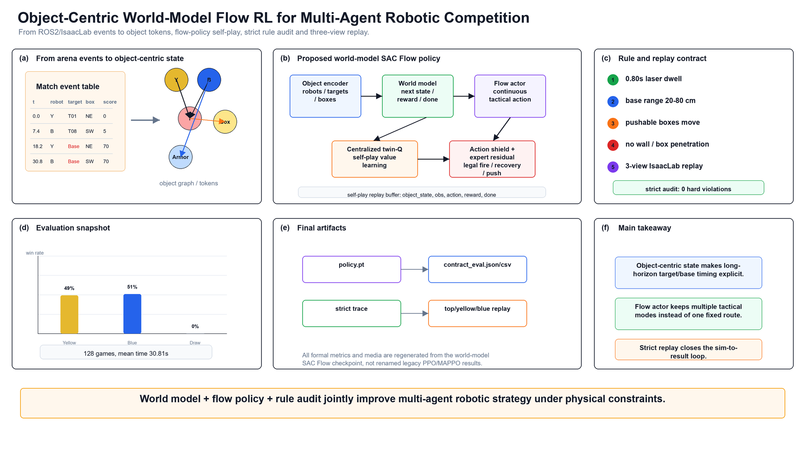

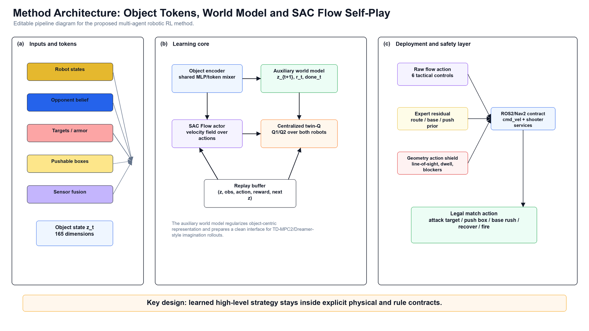

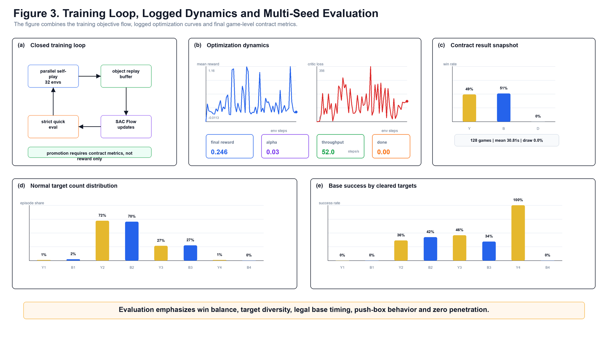

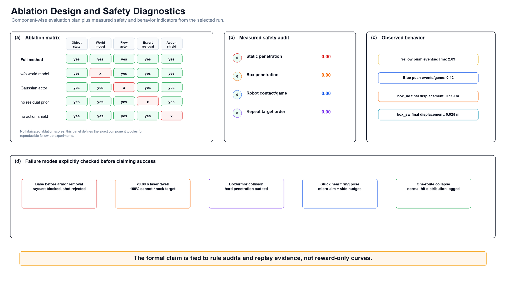

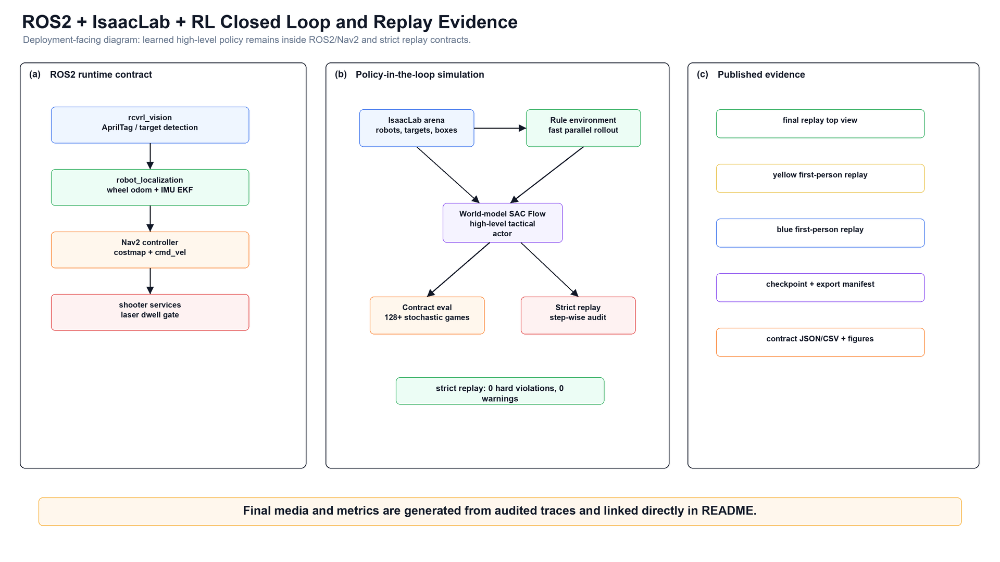

Editable PowerPoint source: [world_model_sacflow_paper_figures_master.pptx](./docs/figures/paper/world_model_sacflow_paper_figures_master.pptx)

Data-driven GPU training and evaluation figures:


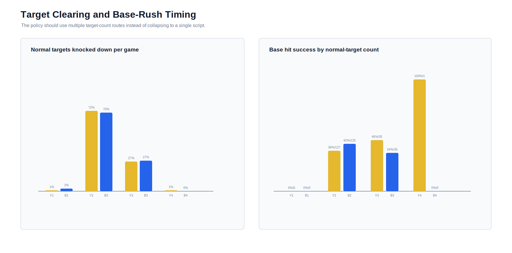

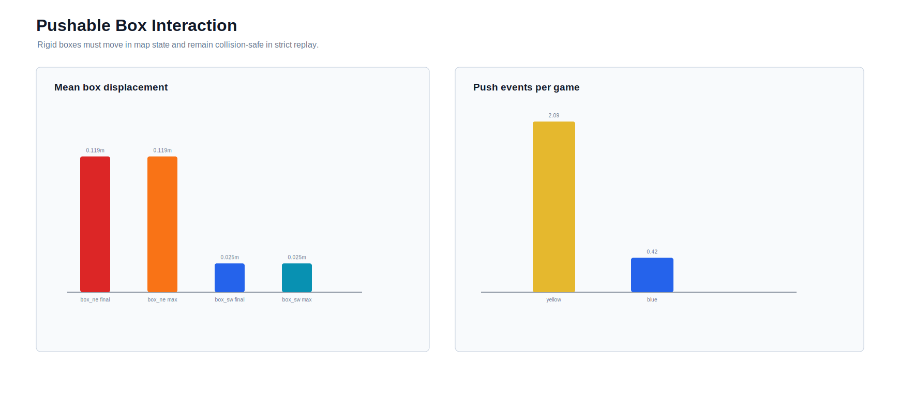

Runtime checkpoints, replay traces and policy exports are generated under `isaaclab_sim/output/` after local training/evaluation and are intentionally ignored by Git except for the explicitly published final checkpoint/result artifacts. The current algorithm plan is in `docs/rl_world_model_flow_policy_plan.md`; the compact reviewer brief is in `docs/admissions_project_brief.md`.

Final stochastic evaluation for the selected residual scale:

| Episodes | Yellow Win | Blue Win | Draw/Timeout | Static Penetrations | Box Penetrations | Robot Contacts/Game |
|---:|---:|---:|---:|---:|---:|---:|
| 128 | 49.22% | 50.78% | 0.00% | 0 | 0 | 0.00 |

Final strict replay audit:

| Episodes | Yellow Win | Blue Win | Draw/Timeout | Hard Violations | Warnings | Own-Target Penalties | Base Wins/Episode |
|---:|---:|---:|---:|---:|---:|---:|---:|
| 8 | 37.50% | 62.50% | 0.00% | 0 | 0 | 0.0 | 1.0000 |

## Capability Boundaries

The public validated multi-agent result is a two-robot yellow-vs-blue adversarial RoboCup-style match. The current repository validates object-centric world-model SAC Flow self-play, rule-aware action shielding, pushable boxes, base blockers, laser dwell/range constraints, ROS2 runtime contracts, IsaacLab three-view replay and subsequent 1v1 real-robot experiment coverage for this two-agent setting.

Large-scale 50v50 is still in the simulation stage: staged rule-level curriculum training, 256-game evaluation and IsaacLab tactical replay are published as a separate benchmark below, but 50v50 has not been moved to real robots. Full 100-robot rigid-body IsaacLab RL, multi-node distributed training and multi-GPU training are not claimed as public validated results. The Sim2Real material documents the ROS2 interface contract, calibration order, domain randomization and deployment validation ladder; 1v1 real-robot trials have been performed, while a full public statistical hardware benchmark with success-rate tables and rosbag release is still future evidence work. See [Capability Boundaries and Measured Evidence](./docs/capability_boundaries.md) for the exact support matrix and metrics.

## Large-Scale 50v50 Benchmark

The repository also includes a large-scale extension for studying 100-agent adversarial coordination before committing to expensive full-physics training. The benchmark uses two teams of 50 differential-drive vehicles in an `80 m x 50 m` arena with three control zones, static cover, shielded bases, line-of-sight shooting, fire cooldowns, agent elimination, base damage, robot-contact metrics and obstacle-contact metrics.

The accepted long-run baseline uses staged population-based swarm-flow policy search: 5v5 first learns the zone-to-shield-to-base attack loop, then 10v10, 25v25 and 50v50 reuse the last passing checkpoint with stricter HP and shield gates. Candidate team policies are sampled, evaluated against archive opponents from both yellow and blue sides, promoted through elite weighting, validated against candidate archives, then evaluated over 256 games. The accepted trace is replayed in IsaacLab with 100 vehicle-shaped actors, visible heading noses, bases, zones, barriers, tactical lanes and a telemetry panel.

Formal 50v50 baseline:

| Final-Stage Training Episodes | Eval Episodes | Yellow Win | Blue Win | Draw | Yellow Base Damage | Blue Base Damage | Robot Contacts Mean/P95 | Obstacle Contacts |
|---:|---:|---:|---:|---:|---:|---:|---:|---:|
| 12000 | 256 | 36.72% | 42.19% | 21.09% | 44.90 | 44.89 | 0.00 / 0.00 | 0.00 |

[50v50 IsaacLab replay MP4](./docs/media/large_scale_50v50_isaaclab_replay.mp4)

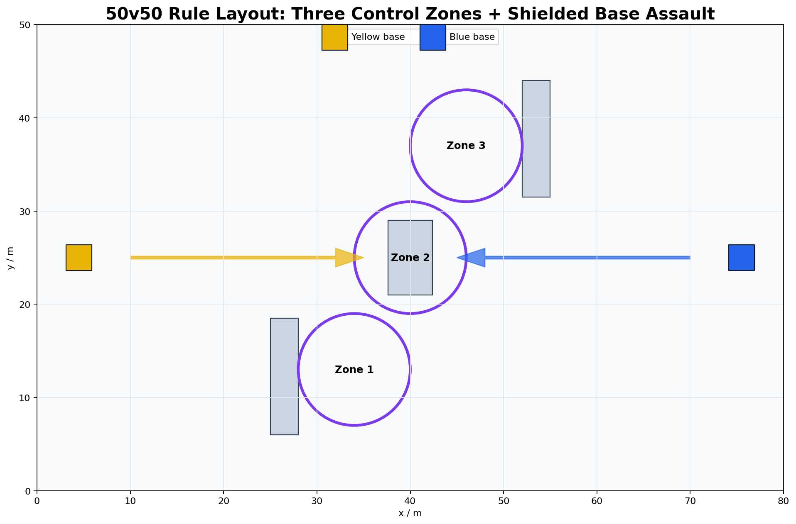

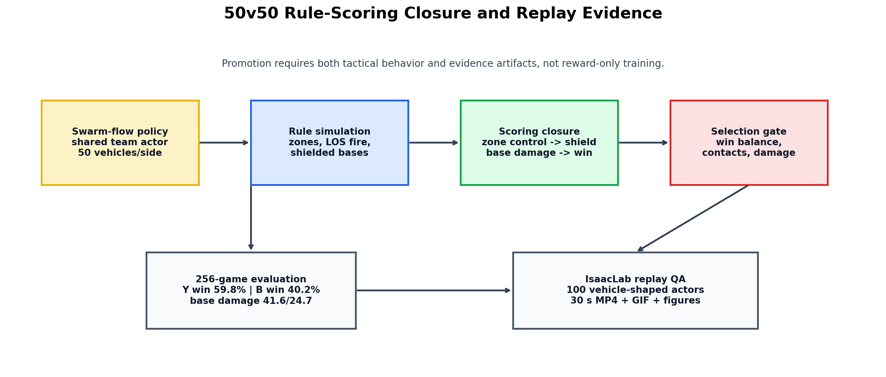

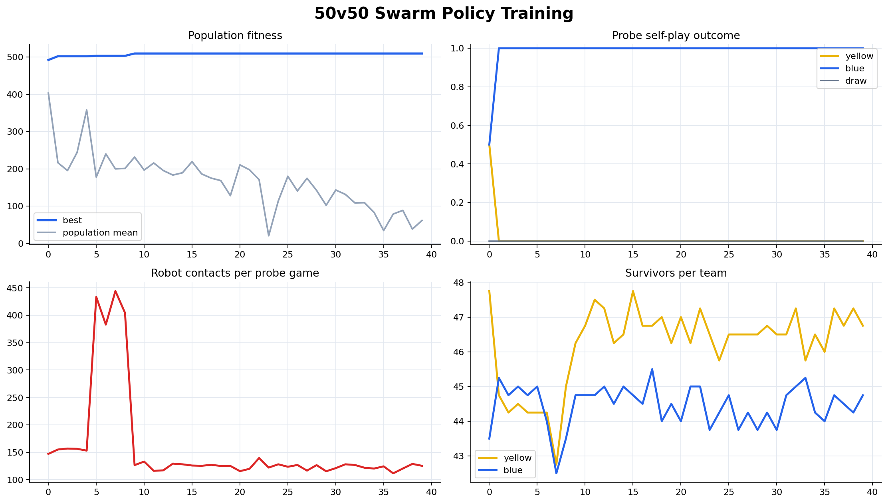

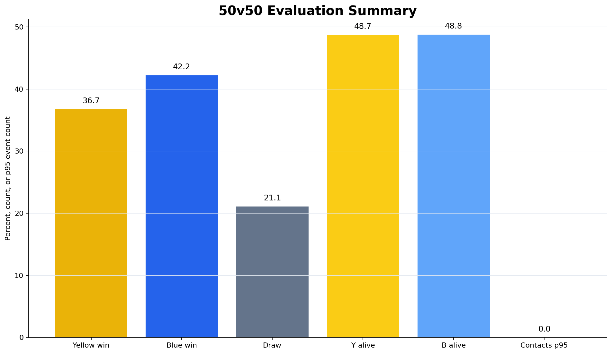

This is a scalable rule-level training benchmark plus IsaacLab tactical replay evidence. It remains a simulation-stage 50v50 result, not a claim that 100 robots have already been trained with full IsaacLab rigid-body physics or deployed on real hardware. The full rule, staged curriculum and evaluation contract are documented in [Large-Scale 50v50 Multi-Agent Battle Plan](./docs/large_scale_50v50_plan.md) and [Large-Scale Curriculum Plan](./docs/large_scale_50v50_curriculum_plan.md); the accepted run is summarized in [Large-Scale 50v50 Multi-Agent Battle Report](./docs/large_scale_50v50_report.md).

## Runtime Evidence

The ROS2 runtime is organized around `rcvrl_bringup`, `rcvrl_behavior`, `rcvrl_vision`, `rcvrl_navigation`, `rcvrl_motion`, `rcvrl_shooter`, `rcvrl_description` and `rcvrl_interfaces`. A demo video is available on Bilibili:

[RoboCup VisionRL runtime/demo video](https://www.bilibili.com/video/BV1Pj9ZBKEc8/?spm_id_from=333.1387.list.card_archive.click&vd_source=f79b94dd69d0c8d08ee5c3400b69d46d)

The compact IsaacLab replay below is generated from the audited physical-box trajectory trace. Both robots leave their start zones at `t=0`, attack opponent-side targets only, push rigid obstacle boxes with changing map poses, trigger armor removal after normal-target hits, and finish with a base-target win. The repository keeps a compact synchronized three-view GIF for GitHub display; full-resolution source videos are treated as local/generated artifacts rather than committed files.


The rendered episode passes strict checks for static-obstacle penetration, pushable-box penetration, target legality, own-target safety, differential-drive step limits and score/armor consistency. The selected 8-episode strict audit reports 37.50% yellow wins, 62.50% blue wins, 0.00% draw/timeout, 0 hard violations and 0 own-target penalties; side balance is measured with the larger stochastic evaluation above.


## Reproducibility

- `docs/admissions_project_brief.md`: concise English portfolio/reviewer summary with contribution, evidence and limitation framing.
- `docs/project_deep_dive.md`: full Chinese deep-dive covering rules, ROS2, IsaacLab, world-model SAC Flow training, evaluation, replay media, data artifacts and Sim2Real deployment.
- `docs/getting_started.md`: step-by-step environment setup, quick demo, ROS2 dry run, IsaacLab preview and troubleshooting.
- `docs/parameter_tuning.md`: algorithm parameter reference and tuning recipes for stuck behavior, base aiming, win balance and resource usage.
- `docs/scene_adaptation.md`: target-layout, blocker, pushable-box and ROS2 route adaptation workflow.
- `docs/capability_boundaries.md`: explicit validated scope, measured metrics, unsupported large-scale/distributed claims and Sim2Real evidence boundary.
- `docs/large_scale_50v50_plan.md`: 100-agent rule-level battle design, training plan, evaluation metrics, replay artifacts and promotion gate.
- `docs/large_scale_50v50_report.md`: generated report for the trained 50v50 baseline.
- `docs/architecture.md`: system architecture and ROS2/IsaacLab component boundaries.
- `docs/reproducibility.md`: exact smoke-test, ROS2 dry-run, IsaacLab preview and evaluation commands.
- `docs/rules_summary.md`: public rule summary used by tests and replay checks.
- `docs/sim2real.md`: sensor calibration, domain randomization and deployment validation plan.
- `docs/strategy.md`: elimination strategy and self-play behavior design.
- `docs/rl_world_model_flow_policy_plan.md`: object-centric world-model + SAC Flow / PolicyFlow algorithm plan.

## Repository Layout

- `config/`: public rule, target-layout and scoring contract used by docs/tests.
- `assets/readme/`: GitHub README preview images.
- `crc_robocup_vision_ws/`: ROS2 workspace for the competition robot.
- `isaaclab_sim/`: IsaacLab arena, rule simulation, and RL training interfaces.
- `docs/`: architecture, strategy, Sim2Real, migration, and result notes.
- `tests/`: pytest checks for RL env contracts, rule gates and Sim2Real configs.
- `THIRD_PARTY_NOTICES.md`: dependency and mesh attribution notes.
