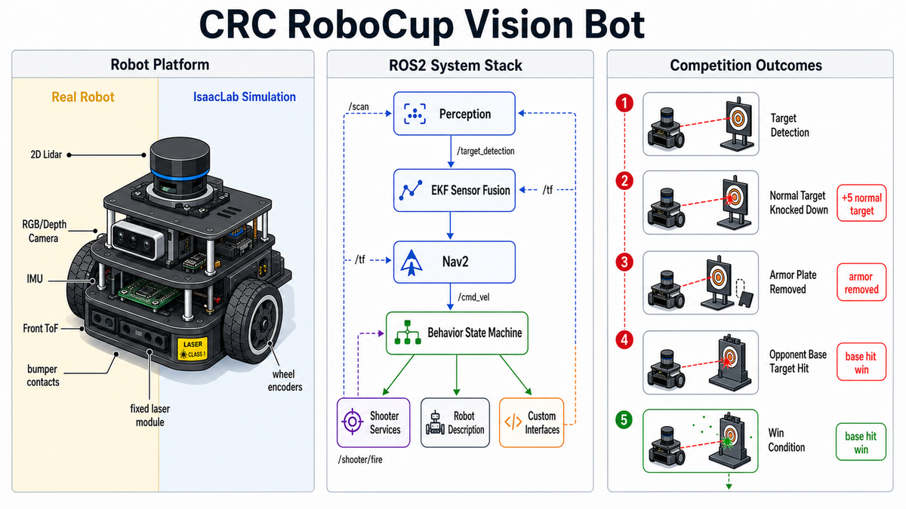
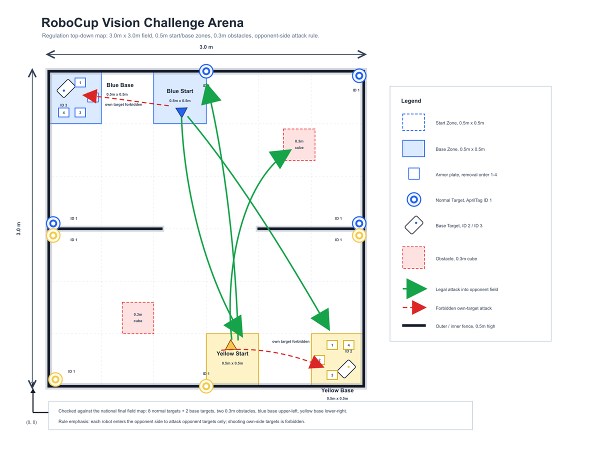
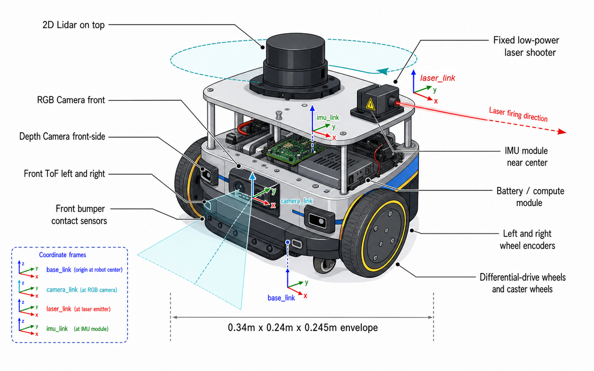
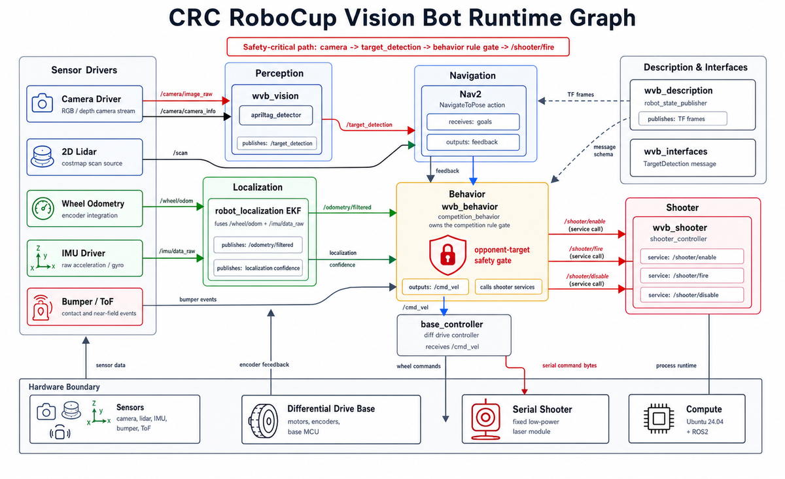
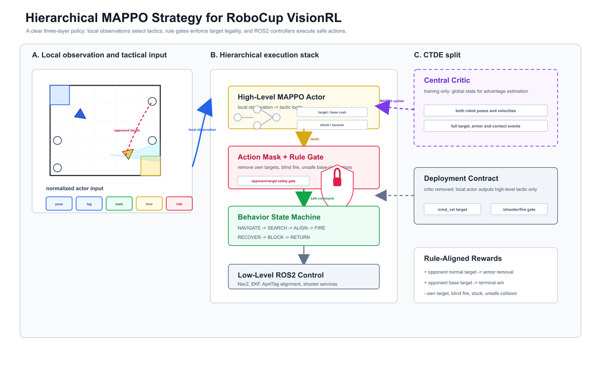
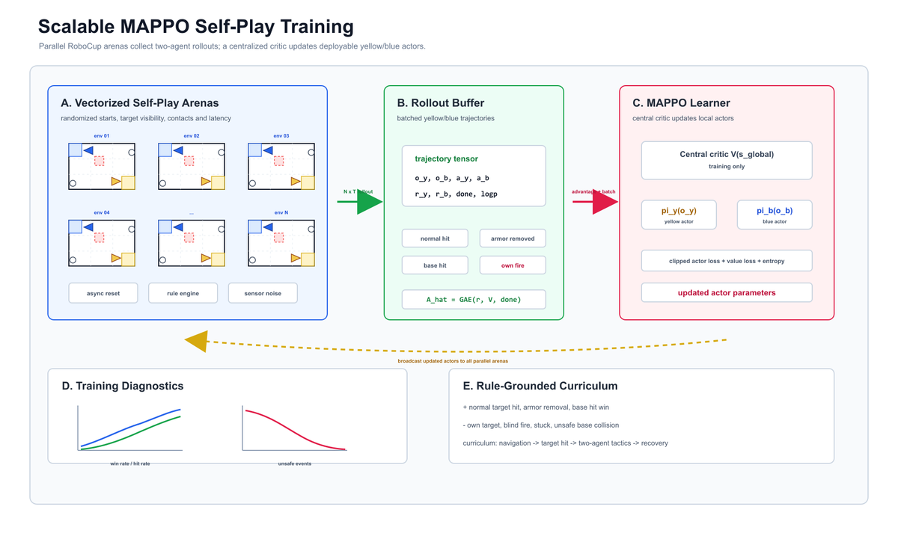
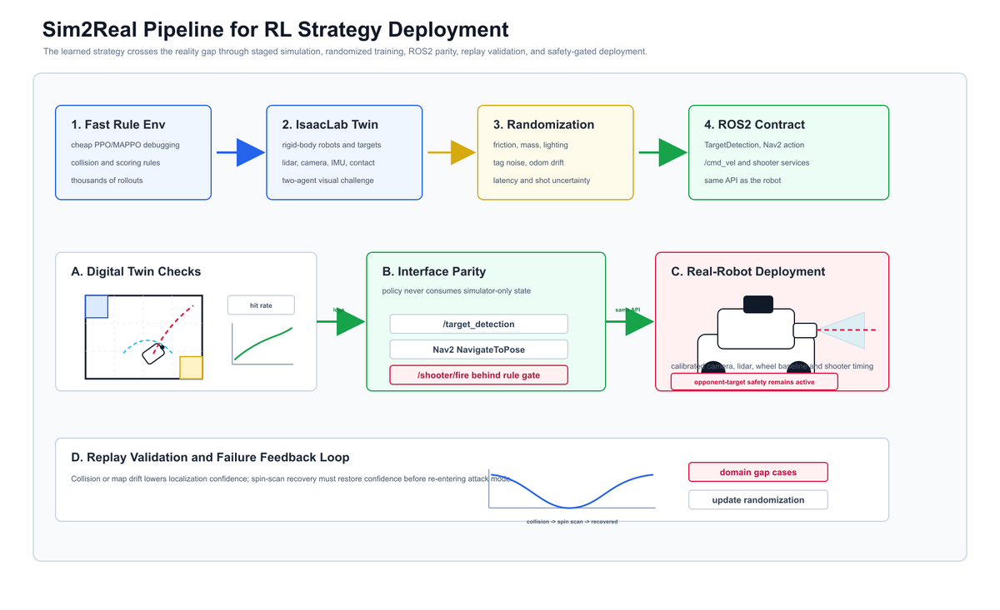

# RoboCup VisionRL: IsaacLab-to-ROS2 Sim2Real

[](https://docs.ros.org/en/jazzy/)
[](https://ubuntu.com/)
[](https://isaac-sim.github.io/IsaacLab/)
[](isaaclab_sim/rl/)
[](LICENSE)

RoboCup VisionRL is a ROS2-based autonomous target-searching and laser-shooting robot project for the China Robot Competition / RoboCup China visual challenge scenario. It combines IsaacLab simulation, reinforcement-learning self-play, Nav2 navigation, AprilTag perception, and a Sim2Real-ready ROS2 runtime contract. The submitted engineering workspace is:

This repository documents the engineering solution evolved from a national top-three RoboCup China visual challenge entry, rewritten as a clean, reproducible, self-contained portfolio system.



```text
crc_robocup_vision_ws/
```

The project has been reorganized from a ROS1 research prototype into a ROS2 Jazzy portfolio project with separated navigation, vision, shooter control, behavior orchestration, robot description and documentation packages.

## Highlights

- ROS2 Jazzy workspace using `colcon` and `ament_cmake`
- Nav2-based navigation with centralized costmap and controller parameters
- `slam_toolbox` mapping/localization configuration
- AprilTag Tag36h11 visual target detection from `/camera/image_raw`
- ROS2 service based shooter controller
- Competition state machine covering navigation, target search, alignment, opponent-only firing, retry and timeout handling
- IsaacLab two-robot arena scene with falling targets, armor removal, differential-drive motion and collision handling
- Realistic sensor stack: wheel odometry, IMU, 2D lidar, RGB/depth camera frames, ToF/bumper contacts and fixed laser module
- Collision/stuck recovery through localization-confidence modeling and spin-in-place map rebuild
- Documentation for architecture, migration, Sim2Real, test results and third-party attribution

## Quick Start

```bash
cd crc_robocup_vision_ws
rosdep install --from-paths src --ignore-src -r -y
colcon build --symlink-install
source install/setup.bash
ros2 launch rcvrl_bringup competition.launch.py
```

Yellow-side elimination launch:

```bash
ros2 launch rcvrl_bringup competition.launch.py team_color:=yellow target_file:=$(ros2 pkg prefix rcvrl_navigation)/share/rcvrl_navigation/config/targets.elimination.yellow.yaml
```

Blue-side elimination launch:

```bash
ros2 launch rcvrl_bringup competition.launch.py team_color:=blue target_file:=$(ros2 pkg prefix rcvrl_navigation)/share/rcvrl_navigation/config/targets.elimination.blue.yaml
```

No-hardware launch smoke test:

```bash
ros2 launch rcvrl_bringup competition.launch.py start_navigation:=false shooter_dry_run:=true auto_start:=false
```

When building from WSL, copy the workspace into a native Linux path such as `~/crc_robocup_vision_ws` first. ROSIDL can fail when the workspace is built directly under a Windows-mounted path containing non-ASCII characters.

Python rule-environment smoke tests:

```bash
python -m pip install -r isaaclab_sim/rl/requirements.txt
python -m pytest tests -q
cd isaaclab_sim/rl
python evaluate_selfplay.py --episodes 8
```

## Target Platform

- Ubuntu 24.04
- ROS2 Jazzy
- OpenCV with ArUco/AprilTag dictionary support
- Nav2
- slam_toolbox

## Portfolio Scope

The ROS2 workspace is the clean submission package. Historical ROS1 material is treated as a migration baseline and documented in `rcvrl_docs/docs/migration.md`; it is not part of the runtime architecture.

Sim2Real calibration and validation are documented in `docs/sim2real.md`. Elimination strategy and RL self-play design are documented in `docs/strategy.md`. A concise rules summary is kept in `docs/rules_summary.md` instead of redistributing official competition PDFs or extracted pages.







## Learning Strategy

The reinforcement-learning layer is implemented under `isaaclab_sim/rl/`. It uses PPO as a fast single-agent baseline and MAPPO-style self-play for two-robot elimination strategy learning.







## Reproducibility

- `docs/reproducibility.md`: exact smoke-test, ROS2 dry-run, IsaacLab preview and evaluation commands.
- `docs/results.md`: measurable evaluation matrix for rule simulation, ROS2 runtime and real-robot transfer.
- `docs/evidence.md`: screenshots/video/log evidence checklist for GitHub and portfolio submission.
- `docs/award_solution.md`: competition background, autonomous design points and national top-three solution framing.

## Repository Layout

- `config/`: public rule, target-layout and scoring contract used by docs/tests.
- `assets/readme/`: GitHub README preview images.
- `crc_robocup_vision_ws/`: ROS2 workspace for the competition robot.
- `isaaclab_sim/`: IsaacLab arena, rule simulation, and RL training interfaces.
- `docs/`: architecture, strategy, Sim2Real, migration, and result notes.
- `tests/`: pytest checks for RL env contracts, rule gates and Sim2Real configs.
- `THIRD_PARTY_NOTICES.md`: dependency and mesh attribution notes.
