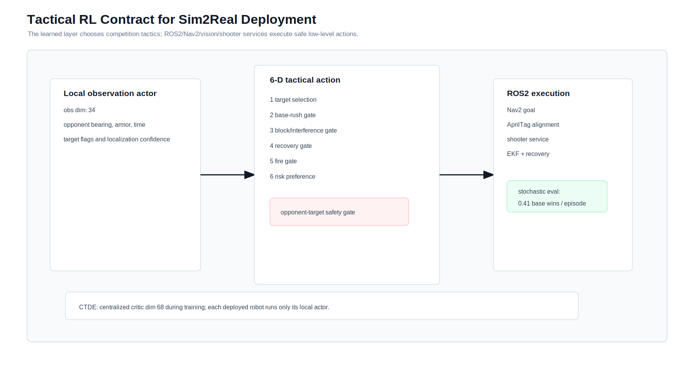

# Reinforcement-Learning Experiments

## Algorithms

| Algorithm | Role | Notes |
| --- | --- | --- |
| Scripted baseline | CI and rule regression | Deterministic, interpretable, not final strategy |
| PPO | Single-agent smoke training | Fast attack baseline for the yellow side |
| MAPPO self-play | Final high-level policy | CTDE training with local actor deployment |

## Completed GPU MAPPO Run

The full tactical self-play run was executed on CUDA with an NVIDIA GeForce RTX 4090. The policy is trained as a MAPPO-style shared actor with a centralized critic: during training the critic observes both robots' local observations, while deployment keeps each robot on its own local actor.

The table below is the archived full run. A newer precision-shooting run is documented in `rl_precision_shooting_model.md`; it changes the shooting gate to `0.05 m` to `0.50 m` from the shooter outlet and adds pushable-obstacle observations.

```bash
python3 isaaclab_sim/rl/train_mappo_selfplay_parallel_torch.py \
  --timesteps 500000 \
  --num-envs 32 \
  --rollout-steps 256 \
  --update-epochs 4 \
  --minibatch-size 2048 \
  --hidden-dim 256 \
  --device cuda \
  --output ../output/rl/mappo_selfplay_full_gpu
```

| Item | Value |
| --- | --- |
| Device | CUDA / NVIDIA GeForce RTX 4090 |
| Torch | 2.11.0+cu128 |
| Agent steps | 507,904 |
| Parallel envs | 32 |
| Observation dim | 34 local, 68 centralized critic |
| Action dim | 6 high-level tactical controls |
| Wall time | 474.243 s |
| Final throughput | 1127 steps/s |

The learned tactical action controls target selection, base-rush gating, blocking/interference, localization recovery, fire gating and risk preference. Low-level motion, aiming, localization and firing remain under ROS2/Nav2/AprilTag/shooter-service contracts so the learned layer is Sim2Real-oriented rather than a simulator-only velocity policy.

## GPU Evaluation Summary

| Evaluation | Episodes | Yellow win | Blue win | Timeout/draw | Normal hits/episode | Base-hit wins/episode | Own-target penalties |
| --- | ---: | ---: | ---: | ---: | ---: | ---: | ---: |
| MAPPO deterministic | 64 | 0.0% | 0.0% | 100.0% | 2.00 | 0.00 | 0.00 |
| MAPPO stochastic | 64 | 0.0% | 40.6% | 59.4% | 4.86 | 0.41 | 0.00 |
| Scripted baseline | 64 | 0.0% | 0.0% | 100.0% | 5.00 | 0.00 | 0.00 |

The deterministic actor is conservative after this training budget. The stochastic actor exposes the intended high-risk strategy: it uses base-rush and blocking decisions and reaches base-hit terminal wins in 40.6% of the evaluation episodes without own-target penalties.

## Strict Post-Training Replay

The trained stochastic MAPPO actor was replayed for 32 episodes with strict rule and motion auditing:

- hard violations: `0`
- warnings: `0`
- own-target penalties per episode: `0.0`
- target-contact knockdowns per episode: `0.0`
- base wins per episode: `0.3438`
- normal hits per episode: `4.9688`

Full audit report: `docs/rl_strict_replay_audit.md`

## Current Final Run

The current final policy is the domain-randomized, action-shielded recessed-base shared actor:

`isaaclab_sim/output/rl/mappo_drshield_recessed_base_shared_gpu_seed419/policy.pt`

Key results:

- 221,184 collected steps, 24 parallel envs, shared actor, residual expert policy.
- Domain randomization enabled for drive/turn scale, push response, shot accuracy, drift loss and sensor noise.
- Action shield enabled for unsafe contact and illegal fire suppression.
- 128 stochastic evaluation episodes: yellow 50.00%, blue 48.44%, draw/timeout 1.56%, base wins/episode 0.9844, own-target penalties 0.0.
- 16 strict replay episodes: hard violations 0, warnings 0, own-target penalties 0.0, base wins/episode 1.0.

Current data snapshot: `docs/rl_data/drshield_recessed_base_shared/`

Current audit report: `docs/rl_drshield_recessed_base_strict_audit.md`

## Data-Driven Figures




The source data used by these figures is committed under `docs/rl_data/mappo_selfplay_full_gpu/`:

- `training_curve.csv`
- `training_curve.jsonl`
- `training_summary.json`
- `mappo_full_gpu_eval.json`
- `mappo_full_gpu_eval_stochastic.json`
- `scripted_rules_baseline_eval.json`

## Reward Ablation Plan

| Ablation | Change | Expected observation |
| --- | --- | --- |
| No own-target penalty | Remove own-target negative reward | More unsafe blind-fire behavior |
| No recovery reward | Remove spin recovery reward | Longer stuck periods after collision |
| No collision context | Flat collision penalty | Less tactical blocking near opponent routes |
| No base-rush reward | Reduce terminal base reward | Over-clears ordinary targets and wastes time |

## Policy Export Contract

The deployable actor must output high-level tactical commands only:

- target selection
- route mode
- base-rush gate
- blocking gate
- recovery gate
- fire gate

The real robot keeps Nav2, AprilTag detection, EKF localization and shooter services in the control loop. This avoids deploying a simulator-only end-to-end velocity policy.

## Deterministic Replay

Use:

```bash
cd isaaclab_sim/rl
python evaluate_selfplay.py --episodes 32 --seed 11
```

The output JSON is written under `isaaclab_sim/output/`, which is ignored by Git.
