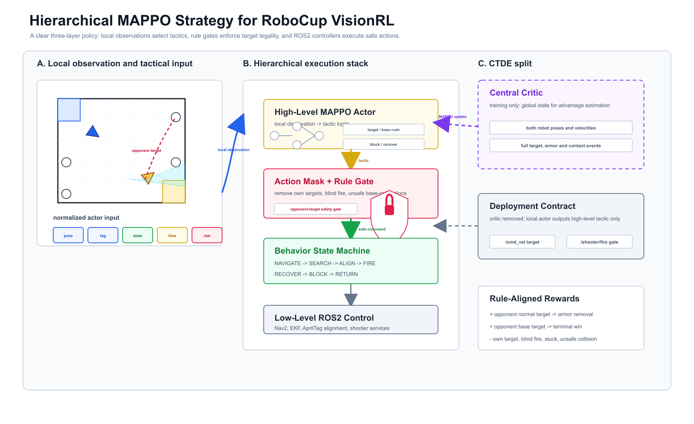
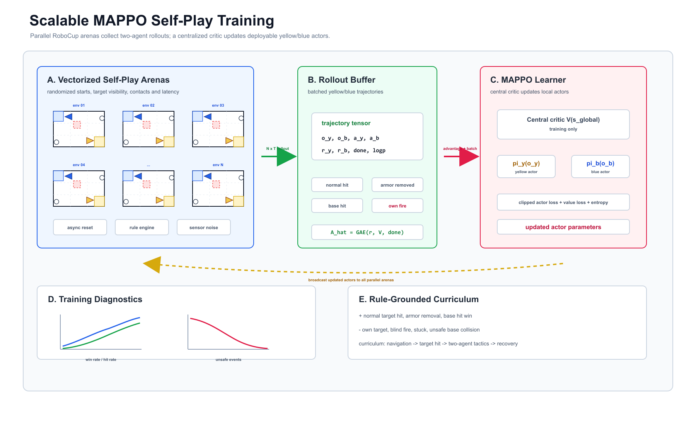
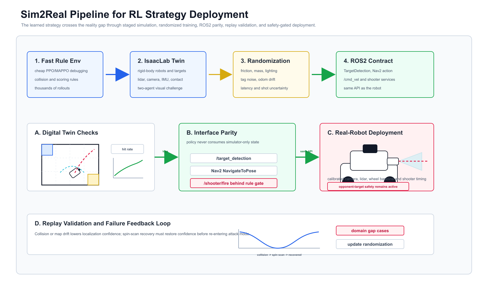

# Elimination Strategy

The first GUI scene uses a scripted policy so the rule scene is easy to inspect. The competition strategy should move to a hierarchical self-play policy:

1. Low-level controller: differential-drive tracking, obstacle avoidance, AprilTag alignment, and shooter timing.
2. Mid-level behavior tree: choose target, navigate, search, align, fire, recover, block, or return.
3. High-level RL policy: choose attack/defense risk under the 180s match clock.

## Tactical Choices

- Opening: shoot the closest high-confidence opponent normal target to remove the first armor plate and create a score lead.
- Base rush: if the opponent base tag is visible and the hit probability is high, attack the base immediately instead of clearing all normal targets.
- Armor break: if the base shot is blocked or the angle is poor, continue shooting opponent normal targets to remove armor in order and improve line of sight.
- Denial: when ahead on score or near the end, block the opponent route or force it to spend time replanning.
- Recovery: if blocked for more than a short window, back up, rotate, and replan rather than pushing blindly.
- Relocalization: if collision or long blocking makes the map/pose estimate unreliable, stop attacking and rotate in place for a full lidar/IMU/camera refresh before choosing the next action.

## Collision And Obstacle Policy

Colliding with the opponent is legal match behavior, but it should be intentional:

- collide only to interrupt the opponent's alignment or protect a base lane
- avoid contact near own base or own normal targets, because collision-caused target falls can award the opponent
- avoid pushing obstacles by default; use it only when the map shows a repeatable advantage and the obstacle is physically movable in the real arena

## RL Recommendation

Use object-centric world-model SAC Flow self-play for the final two-robot strategy. During training, the critic and world model use explicit object state; during runtime, each robot only uses local observations:

- own pose, velocity, odom confidence, and stuck state
- visible tag ID, bearing, range, and confidence
- known target/armor status
- opponent relative pose from lidar/vision when available
- time remaining and recent collision events

Actions should be hierarchical:

- high-level: target ID, base rush, armor break, block, avoid, recover
- low-level: desired `/cmd_vel` and fire gate

Reward should match the rule book:

- opponent normal target hit: positive reward and opponent armor removal
- opponent base target hit: terminal win reward
- own base hit: terminal loss reward
- own normal target / blind fire / stuck / wasted time: penalty
- collision: small positive only when it delays opponent progress, strong penalty if it causes own-side target risk

## Implemented Hooks

- IsaacLab GUI strategy controller dynamically selects attack, base-rush, block, recover, or wait instead of following a fixed target list.
- Shot execution uses the laser ray check before applying the target fall/scoring rule.
- `isaaclab_sim/rl/robocup_visionrl_selfplay_env.py` exposes a two-agent self-play API for SAC Flow training and strict contract evaluation.
- Localization confidence is part of the RL observation. Collisions and blocked motion reduce confidence; spinning in place restores it and receives reward only when confidence is low.
- `isaaclab_sim/rl/robocup_visionrl_selfplay_vec.py` provides a multi-environment rollout interface for parallel self-play collection.
- `isaaclab_sim/rl/robocup_visionrl_gym_env.py` remains as a fast single-agent rule smoke environment, not the formal training algorithm.
